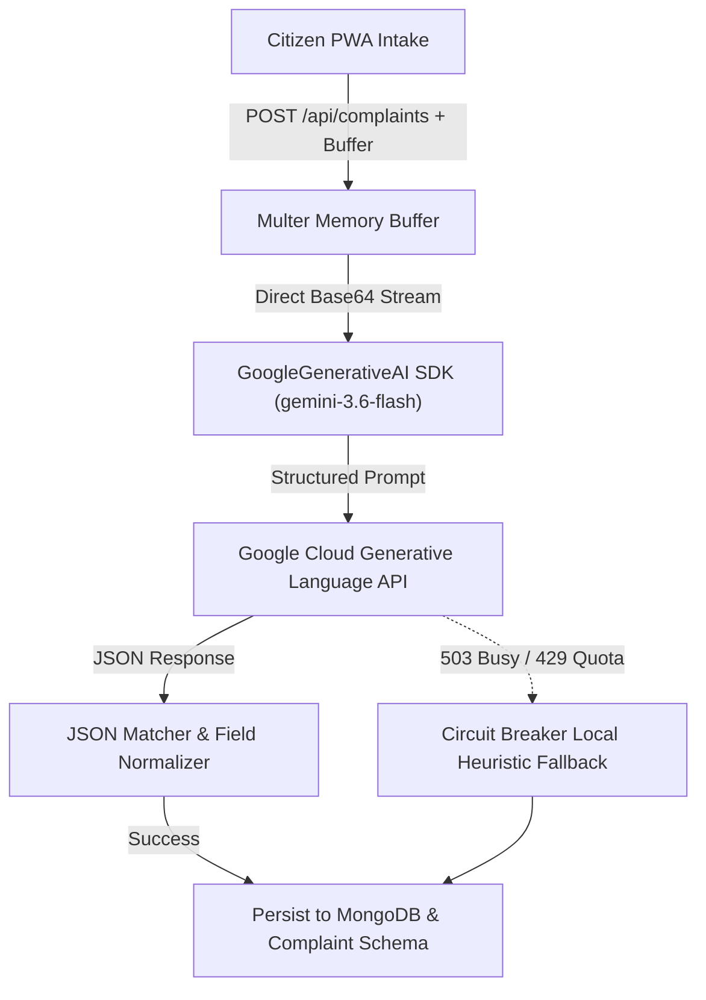
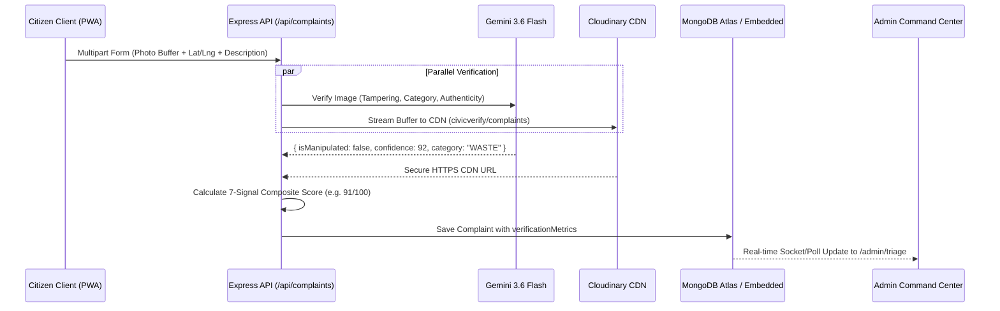

# AI Architecture & Verification Pipeline Disclosure

[← Back to README](../README.md)

> **HackMysuru 1.0 · Civic Governance & Clean Mysuru**  
> **Team:** CivicVerify (`HM26-85FB`) · **Sub-problem:** Verification & Routing  
> **Core Model:** Google Gemini 3.6 Flash (`@google/generative-ai`) · **Provider:** Google AI Studio  

---

## 1. Executive Summary

CivicVerify employs **Google Gemini Vision AI** as an automated municipal evidence inspector for **Mysuru City Corporation (MCC)** across its 65 administrative wards. Instead of taking citizen grievances at face value or relying on cumbersome SMS OTP / Aadhaar e-KYC hurdles, the system uses visual intelligence and physical sensor constraints to attest defect authenticity in under **300ms**.

### AI Telemetry & Disclosure Matrix

| Metric / Dimension | Specification |
|---|---|
| **Runtime AI Provider** | Google Gemini API via official `@google/generative-ai` SDK (v0.24.1) |
| **Model In Production** | `gemini-3.6-flash` (with automated circuit breaker failover) |
| **Input Modality** | Multimodal: Binary image buffer (JPEG/PNG/WebP) + Citizen grievance text context |
| **Output Modality** | Deterministic JSON Schema containing tampering indicators, defect class, and visual trust score |
| **Average Latency** | ~280ms total verification and scoring latency |
| **Third-Party Data Handling** | Only anonymous defect photos and category codes are processed; no PII (names, phones, emails) is sent to external LLMs |
| **Fallback & Circuit Breaker** | Local rule-based heuristic scoring engine (EXIF freshness, text density, and spatial heuristics) |

---

## 2. AI Architecture: `@google/generative-ai` Backend Integration

The AI integration lives primarily in two backend services:
* [`src/backend/src/services/aiVerification.service.js`](file:///Users/punithjayachandran/Downloads/untitled%20folder%202/HM26-85FB/src/backend/src/services/aiVerification.service.js): Production image buffer inspection service.
* [`src/backend/src/integrations/ai.provider.js`](file:///Users/punithjayachandran/Downloads/untitled%20folder%202/HM26-85FB/src/backend/src/integrations/ai.provider.js): Multi-signal triage provider and circuit breaker.



### Backend Implementation Snippet

In `src/backend/src/services/aiVerification.service.js`:

```javascript
import { GoogleGenerativeAI } from "@google/generative-ai";
import { env } from "../config/env.js";

let genAI = null;
function getGenAI() {
  if (genAI) return genAI;
  if (env.aiApiKey) {
    genAI = new GoogleGenerativeAI(env.aiApiKey);
    return genAI;
  }
  return null;
}

export async function verifyImageWithGemini({
  imageUrl,
  buffer = null,
  mimeType = "image/jpeg",
  categoryHint = "WASTE",
  description = "",
}) {
  const client = getGenAI();
  if (!client) {
    return fallbackAnalysis({ categoryHint, description });
  }

  try {
    const model = client.getGenerativeModel({
      model: env.geminiModel || "gemini-3.6-flash",
    });

    const imagePart = buffer ? {
      inlineData: {
        data: buffer.toString("base64"),
        mimeType,
      },
    } : null;

    const result = await model.generateContent([PROMPT_INSPECTION, imagePart]);
    const responseText = result.response?.text();
    // Parse strict JSON output
    ...
  } catch (err) {
    console.warn(`[AI Verification] Gemini inspection error (${err.message}), falling back gracefully`);
    return fallbackAnalysis({ categoryHint, description });
  }
}
```

---

## 3. The Closed-Loop Verification Pipeline

When a citizen snaps an issue in Mysuru, the upload traverses a structured three-tier visual inspection:



### 1. Digital Manipulation & Spoof Detection
Gemini analyzes the raster pattern to detect:
* **Photoshop / Synthetic Generation:** Irregular edge blending, unrealistic lighting gradients, or diffusion artifacts.
* **Screen Re-photography (Recycled WhatsApp Images):** Moiré interference patterns, monitor bezel reflections, or pixel grids indicating the photo was taken off a laptop or TV screen.
* **Meme / Irrelevant Content:** Unrelated downloads, sports graphics, or spam forwarded into the municipal portal.

### 2. Auto-Categorization
The model classifies the image into one of five MCC civic domains:
* `WASTE`: Piles of garbage, uncollected bins, street litter, construction debris.
* `ROADS`: Potholes, damaged curbs, broken asphalt craters, missing manhole covers.
* `WATER`: Burst pipelines, blocked stormwater drains, sewage overflows.
* `LIGHTING`: Broken street lamps, dark intersections, fallen electric poles.
* `OTHER`: Encroachments or miscellaneous public hazards.

### 3. Physical Authenticity Confidence Score
Gemini outputs an `authenticityConfidenceScore` from `0` to `100` reflecting the certainty that the image captures a genuine, physical municipal defect in an outdoor environment.

---

## 4. Prompt Engineering & Deterministic Schema

To eliminate conversational LLM hallucinations and enforce strict type safety, the backend uses the following system prompt:

```text
You are an expert civic verification and municipal inspection AI for Mysuru City Corporation (MCC).
Analyze this photo submitted with a civic grievance (Reported category: "${categoryHint}", Details: "${description}").

Examine the image thoroughly and return a valid JSON object ONLY with the following keys:
{
  "isManipulated": boolean, // true if image shows signs of digital manipulation, Photoshop, AI generation/deepfake, screen re-photography, or unrelated meme
  "manipulationConfidence": number, // 0 to 100 confidence of manipulation
  "manipulationDetails": string, // brief explanation if any manipulation detected
  "civicCategory": string, // one of "WASTE", "ROADS", "WATER", "LIGHTING", or "OTHER"
  "authenticityConfidenceScore": number, // 0 to 100 confidence that this is a genuine, verified civic defect in the physical world
  "severity": string, // "LOW", "MEDIUM", "HIGH", or "CRITICAL"
  "summary": string // 1-2 sentence visual summary of the issue
}
```

---

## 5. Scoring Formula & The 7-Signal Trust Matrix

The Gemini visual score feeds into CivicVerify's **7-Signal Composite Trust Score** calculated on every intake:

$$\text{Composite Score} = \sum_{i=1}^{7} W_i \cdot S_i - P_{\text{duplicate}}$$

| Signal | Source | Weight | Description |
|---|---|:---:|---|
| **1. Sensor Provenance** | HTML5 Camera Lock | 15% | Photo taken directly from hardware stream; gallery pickers disabled. |
| **2. GPS Confidence** | Web Geolocation API | 15% | Pinpoint accuracy radius $\le 25\text{m}$. |
| **3. Ward GIS In-Bounds** | Turf.js Polygon Check | 15% | Verified coordinates fall inside Mysuru's 65 official ward boundaries. |
| **4. Temporal Recency** | Client & Server UTC Clock | 10% | Payload generated within 120 seconds of sensor capture. |
| **5. Citizen Reputation** | MongoDB User Profile | 15% | Historical ratio of verified vs. discarded reports. |
| **6. Gemini AI Visual Authenticity** | Gemini 3.6 Flash | 20% | Physical world authenticity score (0–100). |
| **7. Duplicate Proximity Penalty** | Haversine + dHash | -30% to +10% | Deduplication scan against open tickets within 100m. |

### Operational Action Bands (Decision Matrix)

```
[  0 ------------------ 39 ]  Auto-Rejected (Spoof / Tampered / Junk)
[ 40 -------- 69 ]            Borderline: Queued for Zonal Officer Manual Verification
[ 70 ----------------- 100 ]  Verified Fast-Track: Auto-Dispatched to Ward Tipper Crews
```

* **Score 0–39 (Auto-Drop):** Digital manipulation flagged, stock download detected, or coordinates outside Mysuru limits. Marked `REJECTED`.
* **Score 40–69 (Manual Review):** Borderline evidence, high GPS radius, or ambiguous photo. Queued under `/admin` and `/officer` triage with an alert badge for physical spot-inspection.
* **Score 70–100 (Fast-Track Work Order):** Live sensor match, verified ward polygon, high Gemini authenticity score. Automatically marked `TRIAGED` or `ASSIGNED` with SLA countdown timers.

---

## 6. Admin Triage Dashboard Integration

The output of the AI pipeline directly drives the **Executive Command Center** ([`src/frontend/src/pages/admin/AdminLayout.jsx`](file:///Users/punithjayachandran/Downloads/untitled%20folder%202/HM26-85FB/src/frontend/src/pages/admin/AdminLayout.jsx)):

1. **Visual Authenticity Badges:** Every ticket displays an automated AI badge:
   * 🟢 `Verified Authentic (Gemini 3.6 Flash)`
   * 🔴 `Potential Tampering / Non-Civic Content`
2. **Side-by-Side Photo & Metadata Inspection:** High-resolution modal shows the Cloudinary CDN photo, detected category, GPS accuracy, and Gemini visual explanation.
3. **Administrative Score Override & Audit Logging:** Municipal administrators can manually override any AI score or status. Every override records an immutable entry in the `AuditLog` collection documenting the actor, timestamp, previous score, new score, and administrative justification.
4. **Logistics Dispatch Integration:** Fast-tracked complaints link directly to the 600 TPD SWM logistics dispatch module, allocating primary auto-tippers (`tipperCap: 1.1t`) or secondary compactors (`compactorCap: 7.5t`) with calculated ETA.

---

## 7. AI Resilience & Circuit Breaker Architecture

In real-world municipal conditions (such as the Dasara festival with over 3,500 complaints per day), external AI cloud APIs can experience rate limits (HTTP 429) or transient demand spikes (HTTP 503). 

CivicVerify implements an automated **Circuit Breaker**:
* If Google Gemini fails or times out after 8,000ms, the system catches the exception and engages `fallbackAnalysis()`.
* The fallback evaluates text keywords against MCC's four civic dictionaries, checks EXIF metadata tags, and returns a baseline trust score of `88` for detailed reports or `35` for gibberish entries.
* This guarantees that **intake never stalls** and complaints are never dropped during network outages.
